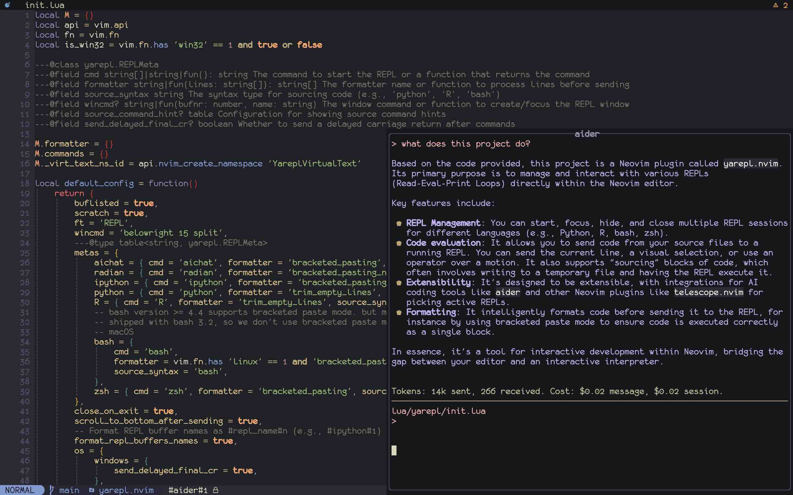
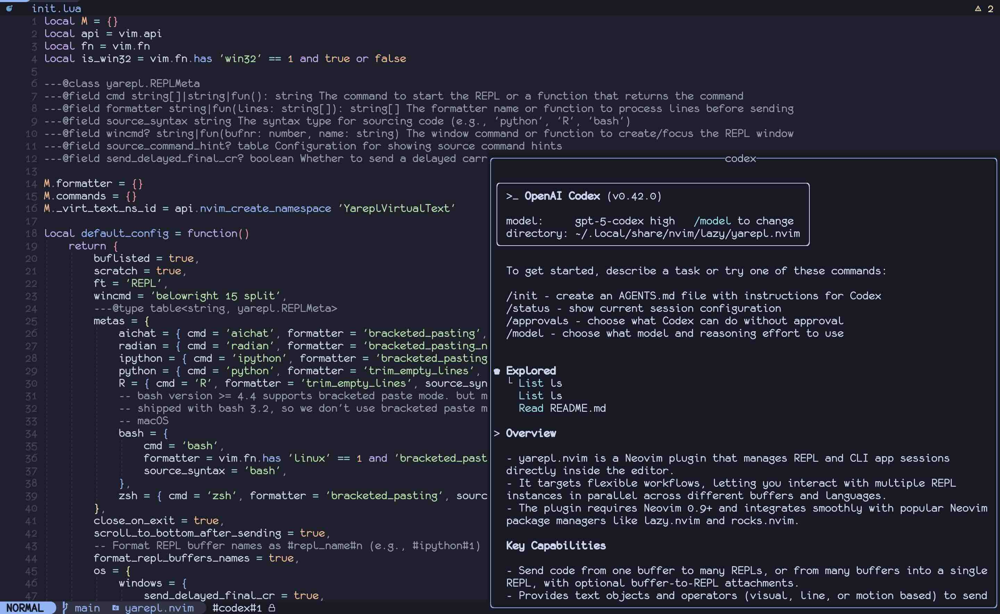

- [yarepl.nvim](#yareplnvim)
- [Showcase](#showcase)
- [Why yarepl.nvim?](#why-yareplnvim)
- [Installation](#installation)
- [Configuration](#configuration)
  - [Setup](#setup)
  - [Commands](#commands)
    - [REPLStart](#replstart)
    - [REPLAttachBufferToREPL](#replattachbuffertorepl)
    - [REPLDetachBufferToREPL](#repldetachbuffertorepl)
    - [REPLCleanup](#replcleanup)
    - [REPLFocus](#replfocus)
    - [REPLHide](#replhide)
    - [REPLHideOrFocus](#replhideorfocus)
    - [REPLClose](#replclose)
    - [REPLSwap](#replswap)
    - [REPLSendVisual](#replsendvisual)
    - [REPLSourceVisual](#replsourcevisual)
    - [REPLSendLine](#replsendline)
    - [REPLSendOperator](#replsendoperator)
    - [REPLSourceOperator](#replsourceoperator)
    - [REPLExec](#replexec)
  - [Keymaps](#keymaps)
- [Window configuration](#window-configuration)
- [Customizing REPLs](#customizing-repls)
  - [Delayed Final CR Option](#delayed-final-cr-option)
- [Customizing the Source Syntax](#customizing-the-source-syntax)
- [Example keybinding setup](#example-keybinding-setup)
- [Extensions](#extensions)
  - [aider](#aider)
  - [codex](#codex)
  - [code-cell](#code-cell)
  - [fzf-lua](#fzf-lua)
  - [telescope](#telescope)
  - [Snacks.picker](#snackspicker)
- [Set up project-level REPLs](#set-up-project-level-repls)
- [Create persistent REPLs in tmux](#create-persistent-repls-in-tmux)
- [FAQ](#faq)
  - [Why lazy loading with `lazy.nvim` doesn't work?](#why-lazy-loading-with-lazynvim-doesnt-work)
  - [How do I avoid clutter from the bufferline plugin?](#how-do-i-avoid-clutter-from-the-bufferline-plugin)
  - [REPLSendVisual is not functioning properly](#replsendvisual-is-not-functioning-properly)
  - [`<Plug>(REPLSendVisual)` Only Sends to First REPL](#plugreplsendvisual-only-sends-to-first-repl)
- [Limitations](#limitations)
- [Acknowledgements](#acknowledgements)

# yarepl.nvim

Yet Another REPL is a flexible REPL / CLI App management tool that supports
multiple paradigms for interacting with them. This plugin also works with
project-level config and tmux, and includes native dot-repeat without requiring
vim-repeat.

Flexibility and parallelism are core priorities. With yarepl.nvim, you can
effortlessly interact with multiple CLI Apps through various paradigms:

- Send text from multiple buffers (same or different file types) to a single
  REPL / CLI App.
- Send text from a single buffer to multiple CLI Apps (same program or different)
- Attach a buffer to a dedicated CLI Apps

The plugin features integration with `aider.chat` and `OpenAI Codex CLI`, and
provides convenient code cell text object definitions. Choose your preferred
fuzzy finder among `telescope`, `fzf-lua`, or `Snacks.picker` to preview active
REPLs. These features are available as [extensions](#extensions).

# Showcase



This image highlights an AI-driven coding assistant and REPL,
[aider.chat](https://aider.chat), managed by `yarepl`.



This example showcases the Codex CLI integration running side by side with a
Neovim buffer, all managed through `yarepl`.

`yarepl` enables integration with the OpenAI's Codex CLI and Aider.chat. For
more details, refer to the [Extensions](#extensions) section.

# Why yarepl.nvim?

With multiple projects at hand, I require the ability to send text from
different files to REPLs with the same type (such as multiple ipython REPLs).

In instances where I'm performing time-consuming tasks, but need to conduct
further experimentation on the current file, I also require the capability to
send text from the same buffer to multiple REPLs.

Furthermore, when conducting mixed-language programming in a literate
programming style in text format such as `rmarkdown`, `quarto`, or plain
`markdown`, I need to send text in the buffer to different REPLs such as R and
Python .

Additionally, `yarepl.nvim` features a `source_syntax` capability that allows
sourcing large code chunks from temporary files instead of sending them
directly to the REPL. This prevents cluttering your interaction history and
provides better handling of substantial code content, especially useful on
Windows where large stdin processing can be problematic. The plugin writes
selected code regions/content to temporary files and provides convenient syntax
definitions for how each REPL should source files.

As a CLI fnatic, to communicate with chatgpt, I prefer through a REPL `aichat`.
Additionally, I require a set of global hotkeys and an isolated REPL
environment to facilitate communication with `aichat` separately without any
interference with other REPLs.

Unfortunately, currently available REPL plugins do not afford me such great
flexibility in managing REPL in multiple ways. This is why `yarepl.nvim` was
created.

# Installation

`nvim 0.9` is required. Although `nvim 0.8` may also work, there are no plans
to ensure backward compatibility with `nvim 0.8` if there are any compatibility
issues.

**lazy.nvim**:

```lua
{ 'milanglacier/yarepl.nvim', config = true }
```

**rocks.nvim**:

`Yarepl` is available on luarocks.org. Simply run `Rocks install yarepl.nvim`
to install it like any other luarocks package.

`yarepl.nvim` does not require any dependencies but functions better with the following plugins:

1. `telescope.nvim` or `fzf-lua`. `yarepl.nvim` provides extensions for REPL
   previewer.

2. A UI frontend that provides an alternative frontend for `vim.ui.select`.
   Some options are `dressing.nvim` or `telescope-ui-select.nvim` (only one of
   them needs to be installed).

# Configuration

## Setup

```lua
-- below is the default configuration, there's no need to copy paste them if
-- you are satisfied with the default configuration, just calling
-- `require('yarepl').setup {}` is sufficient.
local yarepl = require 'yarepl'

yarepl.setup {
    -- see `:h buflisted`, whether the REPL buffer should be buflisted.
    buflisted = true,
    -- whether the REPL buffer should be a scratch buffer.
    scratch = true,
    -- the filetype of the REPL buffer created by `yarepl`
    ft = 'REPL',
    -- How yarepl open the REPL window, can be a string or a lua function.
    -- See below example for how to configure this option
    wincmd = 'belowright 15 split',
    -- The available REPL palattes that `yarepl` can create REPL based on.
    -- To disable a built-in meta, set its key to `false`, e.g., `metas = { R = false }`
    metas = {
        aichat = { cmd = 'aichat', formatter = 'bracketed_pasting', source_syntax = 'aichat' },
        radian = { cmd = 'radian', formatter = 'bracketed_pasting_no_final_new_line', source_syntax = 'R' },
        ipython = { cmd = 'ipython', formatter = 'bracketed_pasting', source_syntax = 'ipython' },
        python = { cmd = 'python', formatter = 'trim_empty_lines', source_syntax = 'python' },
        R = { cmd = 'R', formatter = 'trim_empty_lines', source_syntax = 'R' },
        bash = {
            cmd = 'bash',
            formatter = vim.fn.has 'linux' == 1 and 'bracketed_pasting' or 'trim_empty_lines',
            source_syntax = 'bash',
        },
        zsh = { cmd = 'zsh', formatter = 'bracketed_pasting', source_syntax = 'bash' },
    },
    -- when a REPL process exits, should the window associated with those REPLs closed?
    close_on_exit = true,
    -- whether automatically scroll to the bottom of the REPL window after sending
    -- text? This feature would be helpful if you want to ensure that your view
    -- stays updated with the latest REPL output.
    scroll_to_bottom_after_sending = true,
    -- Format REPL buffer names as #repl_name#n (e.g., #ipython#1) instead of using terminal defaults
    format_repl_buffers_names = true,
    os = {
        -- Some hacks for Windows. macOS and Linux users can simply ignore
        -- them. The default options are recommended for Windows user.
        windows = {
            -- Send a final `\r` to the REPL with delay,
            send_delayed_final_cr = true,
        },
    },
    -- Display the first line as virtual text to indicate the actual
    -- command sent to the REPL.
    source_command_hint = {
        enabled = false,
        hl_group = 'Comment',
    },
}
```

## Commands

`yarepl` doesn't set any default keybindings. Instead, it offers a variety of
commands that you can use to create your own keybindings. We'll also provide an
example configuration for keybindings based on these commands. Additionally,
`yarepl` provides a collection of `<Plug>` keymaps, which you can bind them to
your favorite mappings.

Here is a list of available commands:

### REPLStart

Creates a REPL with id `i` from the list of available REPLs.

You can create a REPL with a specific id by providing a count, such as
`3REPLStart` for a REPL with id `3`. If no count is provided, a new REPL with
increamental ID will be created. You can also provide a name as an argument. If
no argument is given, you'll be prompted to select a REPL from the list of
available ones. If the id is already in use, it will focus on the REPL with
that id. If you append a `!` to the command, the current buffer will attach to
the newly created REPL, for instance, `REPLStart!` or `3REPLStart!`. Note that
attachment only happens when a new REPL is created.

### REPLAttachBufferToREPL

Attaches the current buffer to REPL `i`, for instance,
`3REPLAttachBufferToREPL` will attach the current buffer to REPL 3. If no count
is provided, you'll be prompted to select the REPL you want to attach the
current buffer to. If you add a trailing `!`, it will attempt to detach the
current buffer from any REPL.

### REPLDetachBufferToREPL

Detach current buffer from any REPL.

### REPLCleanup

Cleans up any invalid REPLs and rearranges the sequence of REPL ids. Usually,
there's no need to use this command manually since invalid REPLs are cleaned up
automatically at the appropriate time.

### REPLFocus

Focuses on REPL `i` or the REPL that the current buffer is attached to.

You can provide an optional argument, and the function will attempt to focus on
the closest REPL with the specified name. If no count is supplied, it will try
to focus on the REPL that the current buffer is attached to. If the current
buffer isn't attached to any REPL, it will use REPL 1. If you add a count `i`,
it will focus on the REPL `i`.

Here are some examples of how to use this command:

1. `REPLFocus` will try to focus on the REPL that the current buffer is
   attached to. If the current buffer isn't attached to any REPL, it will use
   REPL 1.

2. `REPLFocus ipython` will try to focus on the closest REPL with the name
   `ipython` starting from id `1`.

3. `3REPLFocus` will focus on REPL 3.

4. `3REPLFocus ipython` will try to focus on the closest REPL with the name
   `ipython` starting from id `3`.

### REPLHide

Hides REPL `i` or the REPL that the current buffer is attached to.

If you provide an optional argument, the function will attempt to hide the
closest REPL with the specified name. When no count is supplied, it will try to
hide the REPL that the current buffer is attached to. If the current buffer
isn't attached to any REPL, it will use REPL 1. If you add a count `i`, it will
hide REPL `i`.

Here are examples of how to use this command:

1. `REPLHide` will try to hide the REPL that the current buffer is attached to.
   If the current buffer isn't attached to any REPL, it will use REPL 1.

2. `REPLHide ipython` will try to hide the closest REPL with the name `ipython`
   starting from id `1`.

3. `3REPLHide` will hide REPL 3.

4. `3REPLHide ipython` will try to hide the closest REPL with the name
   `ipython` starting from id `3`.

### REPLHideOrFocus

Hides or focuses on REPL `i` or the REPL that the current buffer is attached
to.

If you provide an optional argument, the function will attempt to hide or focus
on the closest REPL with the specified name. When no count is supplied, it will
try to hide or focus on the REPL that the current buffer is attached to. If the
current buffer isn't attached to any REPL, it will use REPL 1. If you add a
count `i`, it will hide REPL `i`.

Here are examples of how to use this command:

1. `REPLHideOrFocus` will try to hide or focus on the REPL that the current
   buffer is attached to. If the current buffer isn't attached to any REPL, it
   will use REPL 1.

2. `REPLHideOrFocus ipython` will try to hide or focus on the closest REPL with
   the name `ipython` starting from id `1`.

3. `3REPLHideOrFocus` will hide or focus on REPL 3.

4. `3REPLHideOrFocus ipython` will try to hide or focus on the closest REPL
   with the name `ipython` starting from id `3`.

### REPLClose

Closes REPL `i` or the REPL that the current buffer is attached to.

If you provide an optional argument, the function will attempt to close the
closest REPL with the specified name. If no count is supplied, it will try to
close the REPL that the current buffer is attached to. If the current buffer
isn't attached to any REPL, it will use REPL 1. If you add a count `i`, it will
close REPL `i`.

Here are examples of how to use this command:

1. `REPLClose` will try to close the REPL that the current buffer is attached
   to. If the current buffer isn't attached to any REPL, it will use REPL 1.

2. `REPLClose ipython` will try to close the closest REPL with the name
   `ipython` and starting from id `1`.

3. `3REPLClose` will close REPL 3.

4. `3REPLClose ipython` will try to close the closest REPL with the name
   `ipython` starting from id `3`.

### REPLSwap

Swaps two REPLs. If no REPL ID is provided, you'll be prompted to select both
REPLs. If you provide one REPL ID, you'll be prompted to select the second
REPL.

### REPLSendVisual

Sends the visual range to REPL `i` or the REPL that the current buffer
is attached to.

If you provide an optional argument, the function will attempt to send to the
closest REPL with the specified name. When no count is supplied, it first
checks whether the current buffer is attached to a REPL with that name and uses
it. If the buffer isn't attached to a matching REPL, it will use REPL 1 to find
the closest match. If you add a count `i`, it will send to the closest REPL
with that name relative to `i`.

Here are examples of how to use this command:

1. `REPLSendVisual` sends the visual range to the REPL that the current buffer
   is attached to. If the buffer is not attached to any REPL, it uses REPL 1.

2. `3REPLSendVisual` sends the visual range to REPL 3.

3. `REPLSendVisual ipython` sends the visual range to the attached ipython REPL
   if there is one for the current buffer; otherwise, it uses the closest
   ipython REPL relative to id `1`.

4. `3REPLSendVisual ipython` sends the visual range to the closest ipython REPL
   relative to id `3`.

Note that due to a limitation of vim, when using `REPLSendVisual` via cmdline
rather than in a keymap, you must press `Control+u` before using the command.
For example, `V3j:<Control+u>3REPLSendVisual` sends the selected three lines to
REPL `3`. However, you do not need to specify `Control+u` in your keymap as the
function will do this for you.

### REPLSourceVisual

Similar to `REPLSendVisual`, the key distinction with `REPLSourceVisual` is
that it first writes the visually selected code to a temporary file. It then
sends a one-liner command to the REPL to source this file, instead of sending
the content directly.

The primary advantage of `REPLSourceVisual` lies in handling large code
content. Instead of sending huge code chunks directly to the REPL, it prevents
cluttering your interaction history, maintaining a cleaner session.
Additionally, on Windows, sourcing from a file mitigates potential issues with
stdin processing when the REPL must read substantial input, as the file-based
approach significantly reduces the data read from the stdin.

However, one notable drawback involves the security implications of temporary
file creation. Since the REPL executes code from this file, any vulnerability
in temporary file handling—such as exposure to malicious attack—could pose
security risks. Thus, while beneficial in certain scenarios, this method
requires careful consideration of its potential drawbacks.

Note that the REPL configuration requires a corresponding `source_syntax`
implementation. For more information, refer to the section [Customizing the
Source Syntax](#customizing-the-source-syntax). Built-in source
implementations are available for Python, R, and Bash.

Consider enabling `config.source_command_hint.enabled = true`. When enabled,
the first non-empty line of the code chunk displays as virtual text alongside
the source command sent to the REPL, providing a useful hint about the actual
command being executed.

### REPLSendLine

Sends current line to REPL `i` or the REPL that current buffer is attached to.

If you provide an optional argument, the function will attempt to send to the
closest REPL with the specified name. When no count is supplied, it first
checks whether the current buffer is attached to a REPL with that name and uses
it. If the buffer isn't attached to a matching REPL, it will use REPL 1 to find
the closest match. If you add a count `i`, it will send to the closest REPL
with that name relative to `i`.

Here are examples of how to use this command:

1. `REPLSendLine` sends the current line to the REPL that the current buffer
   is attached to. If the buffer is not attached to any REPL, it uses REPL 1.

2. `3REPLSendLine` sends the current line to REPL 3.

3. `REPLSendLine ipython` sends the current line to the attached ipython REPL
   if there is one for the current buffer; otherwise, it uses the closest
   ipython REPL relative to id `1`.

4. `3REPLSendLine ipython` sends the current line to the closest ipython REPL
   relative to id `3`.

### REPLSendOperator

The operator to send the text to REPL `i` or the REPL that the current buffer
is attached to.

If you provide an optional argument, the function will attempt to send to the
closest REPL with the specified name. When no count is supplied, it first
checks whether the current buffer is attached to a REPL with that name and uses
it. If the buffer isn't attached to a matching REPL, it will use REPL 1 to find
the closest match. If you add a count `i`, it will send to the closest REPL
with that name relative to `i`.

Here are examples of how to use this command:

1. `REPLSendOperator` acts as the operator to send the text to the REPL that
   the current buffer is attached to. If the buffer is not attached to any
   REPL, it uses REPL 1.

2. `3REPLSendOperator` sends the motion to REPL 3.

3. `REPLSendOperator ipython` sends the motion to the attached ipython REPL if
   there is one for the current buffer; otherwise, it uses the closest ipython
   REPL relative to id `1`.

4. `3REPLSendOperator ipython` sends the motion to the closest ipython REPL
   relative to id `3`.

`REPLSendOperator` is **dot-repeatable**, you do not need to install
vim-repeat to make it work.

### REPLSourceOperator

The `REPLSourceOperator` is analogous to the `REPLSendOperator`. To understand
the distinction between these two operators, refer to the section on
`REPLSourceVisual`, which contrasts `REPLSendVisual` with `REPLSourceVisual`.
This comparison provides a clear analogy that highlights the differences
between `REPLSendOperator` and `REPLSourceOperator`.

### REPLExec

Sends the command typed in the cmdline to REPL `i` or the REPL that the current
buffer is attached to.

If the first argument of this command is `$NAME`, the function will attempt to
send to a REPL with the specified `NAME`. If no count is supplied, it first
checks whether the current buffer is attached to a REPL with that name and uses
it. If the buffer isn't attached to a matching REPL, it will use REPL 1 to find
the closest match. If you add a count `i`, it will send to the closest REPL
with that name relative to `i`.

Here are examples of how to use this command:

1. `REPLExec %run a_file.py` will send the command `%run a_file.py` to the REPL 1.

2. `3REPLExec print("hello world")` will send the command `print("hello world")` to the REPL 3.

3. `REPLExec $ipython %whos` will send the command `%whos` to the closest
   ipython REPL relative to id 1.

4. `REPLExec $ipython %whos` will send the command `%whos` to the closest
   ipython REPL relative to id 3.

5. `REPLExec print("hello world")^Mprint("hello world again")` will send the
   following two lines to the REPL current buffer is attached to or REPL 1.

```python
print("hello world")
print("hello world again")
```

Note:

1. To type a **literal** `<Enter>` (`^M`) in `cmdline`, you must press
   `<Ctrl-v> <Enter>` rather than directly type `Enter`.

2. Some neovim command will interpolate `%` to the file name of current buffer.
   But `REPLExec` will not do this for you. The interpolation only happens for
   the first `$` to get the desired `REPL` name.

## Keymaps

`yarepl` provides the following keymaps:

- `<Plug>(REPLStart)`
- `<Plug>(REPLFocus)`
- `<Plug>(REPLHide)`
- `<Plug>(REPLHideOrFocus)`
- `<Plug>(REPLSendLine)`
- `<Plug>(REPLSendOperator)`
- `<Plug>(REPLSendVisual)`
- `<Plug>(REPLSourceOperator)`
- `<Plug>(REPLSourceVisual)`
- `<Plug>(REPLClose)`
- `<Plug>(REPLExec)`

The keymap variant behaves exactly the same as its command variant. For
example, you map `<Leader>s` to `<Plug>(REPLStart)`, then type `<Leader>s` is
equivalent to `:REPLStart`. Type `3<Leader>s` is equivalent to `:3REPLStart`.

And for each meta you registered (say you have a meta named `ipython`), the following keymaps will be registered:

- `<Plug>(REPLStart-ipython)`
- `<Plug>(REPLFocus-ipython)`
- `<Plug>(REPLHide-ipython)`
- `<Plug>(REPLHideOrFocus-ipython)`
- `<Plug>(REPLSendLine-ipython)`
- `<Plug>(REPLSendOperator-ipython)`
- `<Plug>(REPLSendVisual-ipython)`
- `<Plug>(REPLSourceOperator-ipython)`
- `<Plug>(REPLSourceVisual-ipython)`
- `<Plug>(REPLClose-ipython)`
- `<Plug>(REPLExec-ipython)`

For keymaps with a meta, as you would expected, say you bind `<LocalLeader>s`
to `<Plug>(REPLStart-ipython)`, then type `<LocalLeader>s` is equivalent to
`:REPLStart ipython`. Type `3<LocalLeader>s` is equivalent to `:3REPLStart ipython`.

Note that any letters that are not alphanumeric or `-`/`_` will be replaced
with `-`. Say you have a meta named `python a`, the corresponding keymap to
access them will be `<Plug>(REPLStart-python-a)`.

When you are binding those plug keymaps to your own keybindings, make sure this is
a recursive map. e.g. `vim.keymap.set('n', '<Plug>(REPLStart-ipython)', { noremap = false })`.

# Window configuration

if `wincmd` is a string, `yarepl` will execute it as a vimscript command.

```lua
wincmd = 'belowright 15 split'
-- will create a horizontal split below the current using window and takes up 15 lines for the new window
wincmd = 'vertical 30 split'
-- will create a vertical split right to the current using window and takes up 30 columns for the new window
```

In addition to passing a string to `wincmd`, you can also pass a Lua function.
This function accepts two parameters: the buffer number of the REPL buffer, and
the name of the REPL (the keys of `metas`).

```lua
wincmd = function(bufnr, name)
    vim.api.nvim_open_win(bufnr, true, {
        relative = 'editor',
        row = math.floor(vim.o.lines * 0.25),
        col = math.floor(vim.o.columns * 0.25),
        width = math.floor(vim.o.columns * 0.5),
        height = math.floor(vim.o.lines * 0.5),
        style = 'minimal',
        title = name,
        border = 'rounded',
        title_pos = 'center',
    })
end
```

This function creates a floating window at the center of the Vim screen with
specific size and styling.

You can further customize the behavior by applying the `wincmd` configuration
to specific `meta` entries. When a `meta` includes its own `wincmd` setting, it
overrides the global `wincmd`.

```lua

float_wincmd = function(bufnr, name)
    vim.api.nvim_open_win(bufnr, true, {
        relative = 'editor',
        row = math.floor(vim.o.lines * 0.25),
        col = math.floor(vim.o.columns * 0.25),
        width = math.floor(vim.o.columns * 0.5),
        height = math.floor(vim.o.lines * 0.5),
        style = 'minimal',
        title = name,
        border = 'rounded',
        title_pos = 'center',
    })
end

yarepl.setup {
    metas = {
        -- REPL local settings
        ipython = { wincmd = 'topleft 25 split' },
        radian = { wincmd = float_wincmd },
    }
    -- global settings
    wincmd = 'belowright 15 split',
}
```

Similar to `wincmd` (which allows you to configure a global default with
meta-local overrides), you can also set meta-local overrides for
`source_command_hint`. The configuration option name for meta-local overrides
is identical to the global setting.

# Customizing REPLs

You can disable a built-in REPL meta by set the key to `false`:

```lua
metas = {
    R = false
}
```

To modify a built-in meta's settings, simply override the specific option.
There's no need to copy the default values for other options:

```lua
metas = {
    ipython = { cmd = { 'ipython', '--simple-prompt' } }
}
```

You can add your own REPL meta by following this example:

```lua
function send_line_verbatim(lines)
    -- each line is a string
    return lines
end

function ipython_or_python()
    if vim.fn.executable 'ipython' == 1 then
        return { 'ipython', '--simple-prompt' }
    else
        return 'python'
    end
end

function ipython_or_python_formatter(lines)
    if vim.fn.executable 'ipython' == 1 then
        return yarepl.formatter.bracketed_pasting(lines)
    else
        return yarepl.formatter.trim_empty_lines(lines)
    end
end

metas = {
    ipython_new = { cmd = { 'ipython', '--simple-prompt' }, formatter = send_line_verbatim },
    ipython_or_python = { cmd = ipython_or_python, formatter = ipython_or_python_formatter },
}

```

`cmd` can be three types: a string, a list of strings, or a function that
returns either a string or list of strings.

`formatter` can be either:

1. A string that matches a builtin formatter name:
   - `bracketed_pasting`: wrap the content within bracketed paste sequences
   - `bracketed_pasting_no_final_new_line`: similar to `bracketed_pasting`, but does not add a new line at the end
   - `bracketed_pasting_delayed_cr`: similar to `bracketed_pasting`, but use with `send_delayed_final_cr = true`
   - `trim_empty_lines`: remove empty lines from the input
2. A function that takes a list of strings as input and returns a list of
   strings to send to the REPL

[Here is a more complex example for ghci, a haskell repl.](https://github.com/milanglacier/yarepl.nvim/issues/21)

`yarepl` offers a convenient helper function that simplifies the process of
creating a custom formatter without starting from scratch. For usage examples
and general guidelines on setting your own REPL formatter, expand the
**Details** section below.

<details>

Some REPLs can distinguish between pasted text and text from the user manual
input by using prefix and suffix sequences, such as bracketed paste.

For modern REPLs with bracketed pasting support (which is usually the case), it
is recommended to use "`bracketed_pasting`"

Here are some tips for writing your own formatter function:

1. You may want to add a new entry `"\r"` at the end of the list to indicate
   the end of input.

2. If your REPL cannot distinguish between copy-pasted text and text from user
   manual input, you may want to replace `\t` with 4 or 8 spaces since sending
   a raw `\t` may be interpreted as invoking completion.

3. Do not include `\n` in any line as the `chansend` function will
   automatically replace it with `\0`.

4. You may want to remove any empty lines from the input (a list of strings)
   since `chansend` function translates an empty string `""` into `"\n"`. For
   some REPLs without bracketed pasting support (such as Python), a plain
   `"\n"` may be treated as the end of input, blocking the rest of the code in
   the same function.

5. If your REPL cannot distinguish between copy-pasted text and text from user
   manual input and your REPL will do auto-indent for you, you may want to
   remove any leading spaces from each line to prevent double indentation.

6. The returned list of strings will be sent to the `chansend` function for
   reference.

```lua
-- Calling this function will return a function that takes a list of strings as
-- input and returns a list of strings. This can be used as the formatter function
-- of meta.

-- these are the default config
yarepl.formatter.factory {
    -- Specifies whether to return tabs in the string as spaces.
    replace_tab_by_space = false,
    -- Specifies the number of spaces to replace the tab (if enabled).
    number_of_spaces_to_replace_tab = 8,
    -- For a list of strings containing more than one string:
    when_multi_lines = {
        -- The prefixing code sent to the repl firstly.
        open_code = '',
        -- The suffixing code sent to the repl finally.
        end_code = '\r',
        -- Whether to remove empty lines from the list of strings.
        trim_empty_lines = false,
        -- Whether to remove leading spaces at the beginning of each line.
        remove_leading_spaces = false,
        -- If gsub_pattern and gsub_repl are not empty, `string.gsub` will
        -- be called with `gsub_pattern` and `gsub_repl` on each line. Note
        -- that you should use Lua pattern instead of Vim regex pattern.
        -- The gsub calls happen after `trim_empty_lines`,
        -- `remove_leading_spaces`, and `replace_tab_by_space`, and before
        -- prepending and appending `open_code` and `end_code`.
        gsub_pattern = '',
        gsub_repl = '',
    },
    -- For a list containing only one string:
    when_single_line = {
        -- The prefixing code sent to the repl firstly.
        open_code = '',
        -- The suffixing code sent to the repl finally.
        end_code = '\r',
        -- the same as the specs of `when_multi_lines`
        gsub_pattern = '',
        gsub_repl = '',
    },
    os = {
        -- Some hacks for Windows. macOS and Linux users can simply ignore
        -- them. The default options are recommended for Windows user.
        windows = {
            -- Join the lines with `\r` before sending to REPL.
            join_lines_with_cr = true,
        },
    },
}

-- `yarepl` provides four builtin formatters that can be referenced by name:
-- 1. 'bracketed_pasting' - Uses bracketed paste mode for modern REPLs
-- 2. 'bracketed_pasting_no_final_new_line' - Same as above but without final newline
-- 3. 'bracketed_pasting_delayed_cr': similar to `bracketed_pasting`, but use with `send_delayed_final_cr = true`
-- 4. 'trim_empty_lines' - Trims empty lines from input

-- You can also create custom formatters by calling `yarepl.formatter.factory`:

yarepl.formatter.trim_empty_lines = yarepl.formatter.factory {
    when_multi_lines = {
        trim_empty_lines = true,
        remove_leading_spaces = false,
    },
}

yarepl.formatter.bracketed_pasting = yarepl.formatter.factory {
    when_multi_lines = {
        open_code = '\27[200~',
        end_code = '\27[201~\r',
        trim_empty_lines = false,
        remove_leading_spaces = false,
    },
}
```

</details>

## Delayed Final CR Option

`send_delayed_final_cr` (optional, defaults to `false`): Some REPLs do not
recognize the final CR (return)'s purpose is to tell the REPL that we want to
"finalize" (or evaluate) that command when it is input with a large chunk of
text when bracketed pasting is enabled. To mitigate this, we have to send the
final CR with a delay (to let the REPL realize that we want to evaluate that
command). In general we should ignore this option (keep it as the default
`false`). When you do enable this option, prefer using the
`bracketed_pasting_delayed_cr` formatter so that the final CR is not included
in the initial stream (it will be sent by the delayed event). The two observed
exceptions are Claude Code and OpenAI Codex which should use `true`. PRs are
welcome if you find other REPLs that require setting this option to `true`.

Example usage:

```lua
metas = {
    claude_code = {
        cmd = 'claude',
        formatter = 'bracketed_pasting_delayed_cr',
        source_syntax = '@{{file}}',
        send_delayed_final_cr = true
    },
    ipython = {
        cmd = 'ipython',
        formatter = 'bracketed_pasting',
        send_delayed_final_cr = false  -- this is the default, can be omitted
    },
    -- yarepl provides builtin extension to use with codex.
    codex = require('yarepl.extensions.codex').create_codex_meta(),
}
```

# Customizing the Source Syntax

To utilize `REPLSourceOperator` and `REPLSourceVisual`, your REPL meta
configuration must include either `source_syntax`.

Here's an example setup using `yarepl` with a source syntax:

```lua
local yarepl = require 'yarepl'

yarepl.setup {
    metas = {
        radian = {
            cmd = 'radian',
            formatter = 'bracketed_pasting_no_final_new_line',
            source_syntax = 'eval(parse(text = "{{file}}"))',
        },
    }
}
```

When `source_syntax` is specified, the selected code content is initially
written to a temporary file. Here, `{{file}}` serves as a placeholder, which is
replaced by the temporary file path. The interpolated string is subsequently
sent to the REPL.

Several built-in `source_syntax` options can be accessed as strings: `R`,
`aichat`, `bash`, `ipython` and `python`.

For a more flexible "sourcing" behavior, you can also define `source_syntax` as
a function, instead of using a string with `{{file}}`. This function must take
a string and return a string. The input is the selected code, and the output is
what gets sent to the REPL.

A common approach involves writing the input string to a temporary file, then
returning a string that sources this file. The exact "sourcing" syntax depends
on the target programming language.

Here's an example setup using `yarepl` with a source function:

<details>

```lua
local yarepl = require 'yarepl'
local python_source_func = function(str)
    local file = make_tmp_file(str)
    if not file then
        return
    end

    local cmd = string.format('exec(open("%s", "r").read())', file)
    return cmd
end


yarepl.setup {
    metas = {
        ipython = {
            cmd = 'ipython',
            formatter = 'bracketed_pasting',
            source_syntax = python_source_func,
        },
    }
}
```

</details>

# Example keybinding setup

If you don't want to use those `<Plug>` keymaps provided by the plugin but
instead want to build the keymaps by your own, please check the
[wiki.](https://github.com/milanglacier/yarepl.nvim/wiki/Example-Keymap-setup-without-using-%60-Plug-%60)

Here is the keybindings setup from the maintainer:

```lua
local keymap = vim.api.nvim_set_keymap
local bufmap = vim.api.nvim_buf_set_keymap

keymap('n', '<Leader>cs', '<Plug>(REPLStart-aichat)', {
    desc = 'Start an Aichat REPL',
})
keymap('n', '<Leader>cf', '<Plug>(REPLFocus-aichat)', {
    desc = 'Focus on Aichat REPL',
})
keymap('n', '<Leader>ch', '<Plug>(REPLHide-aichat)', {
    desc = 'Hide Aichat REPL',
})
keymap('v', '<Leader>cr', '<Plug>(REPLSendVisual-aichat)', {
    desc = 'Send visual region to Aichat',
})
keymap('v', '<Leader>cR', '<Plug>(REPLSourceVisual-aichat)', {
    desc = 'Source visual region to Aichat',
})
keymap('n', '<Leader>crr', '<Plug>(REPLSendLine-aichat)', {
    desc = 'Send lines to Aichat',
})
keymap('n', '<Leader>cr', '<Plug>(REPLSendOperator-aichat)', {
    desc = 'Send Operator to Aichat',
})
keymap('n', '<Leader>cr', '<Plug>(REPLSourceOperator-aichat)', {
    desc = 'Source Operator to Aichat',
})
keymap('n', '<Leader>ce', '<Plug>(REPLExec-aichat)', {
    desc = 'Execute command in aichat',
})
keymap('n', '<Leader>cq', '<Plug>(REPLClose-aichat)', {
    desc = 'Quit Aichat',
})


local ft_to_repl = {
    r = 'radian',
    R = 'radian',
    rmd = 'radian',
    quarto = 'radian',
    markdown = 'radian',
    python = 'ipython',
    sh = 'bash',
}

autocmd('FileType', {
    pattern = { 'quarto', 'markdown', 'markdown.pandoc', 'rmd', 'python', 'sh', 'REPL', 'r' },
    group = my_augroup,
    desc = 'set up REPL keymap',
    callback = function()
        local repl = ft_to_repl[vim.bo.filetype]
        repl = repl and ('-' .. repl) or ''

        bufmap(0, 'n', '<LocalLeader>rs', string.format('<Plug>(REPLStart%s)', repl), {
            desc = 'Start an REPL',
        })
        bufmap(0, 'n', '<LocalLeader>rf', '<Plug>(REPLFocus)', {
            desc = 'Focus on REPL',
        })
        bufmap(0, 'n', '<LocalLeader>rv', '<CMD>Telescope REPLShow<CR>', {
            desc = 'View REPLs in telescope',
        })
        bufmap(0, 'n', '<LocalLeader>rh', '<Plug>(REPLHide)', {
            desc = 'Hide REPL',
        })
        bufmap(0, 'v', '<LocalLeader>s', '<Plug>(REPLSendVisual)', {
            desc = 'Send visual region to REPL',
        })
        bufmap(0, 'v', '<LocalLeader>S', '<Plug>(REPLSourceVisual)', {
            desc = 'Source visual region to REPL',
        })
        bufmap(0, 'n', '<LocalLeader>ss', '<Plug>(REPLSendLine)', {
            desc = 'Send line to REPL',
        })
        bufmap(0, 'n', '<LocalLeader>s', '<Plug>(REPLSendOperator)', {
            desc = 'Send operator to REPL',
        })
        bufmap(0, 'n', '<LocalLeader>S', '<Plug>(REPLSourceOperator)', {
            desc = 'Source operator to REPL',
        })
        bufmap(0, 'n', '<LocalLeader>re', '<Plug>(REPLExec)', {
            desc = 'Execute command in REPL',
            expr = true,
        })
        bufmap(0, 'n', '<LocalLeader>rq', '<Plug>(REPLClose)', {
            desc = 'Quit REPL',
        })
        bufmap(0, 'n', '<LocalLeader>rc', '<CMD>REPLCleanup<CR>', {
            desc = 'Clear REPLs.',
        })
        bufmap(0, 'n', '<LocalLeader>rS', '<CMD>REPLSwap<CR>', {
            desc = 'Swap REPLs.',
        })
        bufmap(0, 'n', '<LocalLeader>r?', '<Plug>(REPLStart)', {
            desc = 'Start an REPL from available REPL metas',
        })
        bufmap(0, 'n', '<LocalLeader>ra', '<CMD>REPLAttachBufferToREPL<CR>', {
            desc = 'Attach current buffer to a REPL',
        })
        bufmap(0, 'n', '<LocalLeader>rd', '<CMD>REPLDetachBufferToREPL<CR>', {
            desc = 'Detach current buffer to any REPL',
        })
    end,
})

```

With the keybinding setup, prefixing keybindings with <Leader>c ensures that
the text is always sent to the aichat REPL, a REPL for chatgpt.

For maximum flexibility with other programming languages, the maintainer
desires the ability to easily switch between two modes:

1. Sending text from multiple files to a REPL via `2<LocalLeader>s`, regardless
   of which buffer the maintainer is visiting. This guarantees that the text is
   always sent to `RPEL 2`.

2. Sending text to a dedicated REPL for each buffer. To avoid the hassle of
   remembering the exact ID associated with the desired REPL, the maintainer
   can use `<LocalLeader>ra` to attach the current buffer to a REPL.
   Subsequently, the `<LocalLeader>s` key can be directly used to send the text
   to the desired REPL.

# Extensions

The `Extensions` module contains extended functionalities built upon the core
of yarepl.nvim. While not considered as core part of yarepl, it offers valuable
additional features. For comprehensive information about the features, please
refer to [extensions/README.md](extensions/README.md).

Currently, the module includes:

## aider

This module enhances AI-assisted coding capabilities through
[aider.chat](https://aider.chat) integration.

## codex

This module enhances AI-assisted coding capabilities through [OpenAI's Codex
CLI](https://github.com/openai/codex) integration.

## code-cell

This module simplifies the creation of code cell text objects, allowing you to
utilize them with `REPLSendOperator` or other operators such as paste, delete,
and formatting.

## fzf-lua

This module provides a fuzzy finder interface to preview active REPLs with `fzf-lua`.

## telescope

This module provides a fuzzy finder interface to preview active REPLs with `telescope`.

## Snacks.picker

This module provides a fuzzy finder interface to preview active REPLs with `Snacks.picker`.

# Set up project-level REPLs

You may want to have the ability to control the REPL metas at the project
level. For example, you may want to open `ipython` installed in a conda
environment for one project and a different `ipython` installed in another
conda environment for another project.

One way to achieve this is to:

- Enable the built-in `exrc`, which requires `nvim 0.9` for security reasons.

To enable `exrc`, add the following line to your Neovim config:

```lua
vim.o.exrc = true
```

Then, configure `yarepl` like so:

```lua
vim.g.yarepl_ipython_paths = vim.g.yarepl_ipython_paths or {}
local yarepl = require 'yarepl'

require('yarepl').setup {
    metas = {
        ipython = {
            cmd = function()
                local cwd = vim.fn.getcwd()
                if vim.g.yarepl_ipython_paths and vim.g.yarepl_ipython_paths[cwd] then
                    return vim.g.yarepl_ipython_paths[cwd]
                else
                    return 'ipython'
                end
            end,
        },
    },
}
```

Now, in the project root directory `~/projects/project1`, create a file
called `.nvim.lua` with the following lines:

```lua
local cwd = vim.fn.getcwd()

if vim.g.yarepl_ipython_paths then
    vim.g.yarepl_ipython_paths[cwd] = '~/mambaforge/envs/a-conda-env/bin/ipython'
else
    vim.g.yarepl_ipython_paths = {
        [cwd] = '~/mambaforge/envs/a-conda-env/bin/ipython',
    }
end
```

The first time you open `project1`, Neovim will prompt you to decide whether
you want to load the `.nvim.lua` file. Please allow it.

**Note:** The `.nvim.lua` file will be automatically loaded only once when
Neovim starts. Thus, if you switch working directories during the time Neovim
is running, the `.nvim.lua` file won't be loaded at the new working directory.
To manually load the `.nvim.lua` file after switching to a new working
directory, try `:luafile .nvim.lua`.

# Create persistent REPLs in tmux

If you would like to maintain a persistent REPL process even after exiting
neovim, you can utilize tmux. To achieve this, the following configuration
creates a REPL meta named `ipy_tmux` that attaches to a tmux session named
`ipython`. If the session does not exist, a new tmux session named `ipython` is
created, and an `ipython` REPL is started.

```lua
metas = {
    ipy_tmux = {
        cmd = 'tmux attach -t ipython || tmux new -s ipython ipython',
        formatter = yarepl.formatter.bracketed_pasting,
    },
}
```

# FAQ

## Why lazy loading with `lazy.nvim` doesn't work?

We recommend using `event = 'VeryLazy'` to do the lazy loading. If you want to
use `keys` to lazy load this plugin, make sure you are using recursive mapping:

```lua
-- Recommended
return {
    'milanglacier/yarepl.nvim',
    event = 'VeryLazy',
    config = function()
        -- add your configs here
    end,
}

-- Also works, but use with caution!
return {
    'milanglacier/yarepl.nvim',
    keys = {
        { '<Leader>s', '<Plug>(REPLStart)', noremap = false, mode = 'n' },
        { '<LocalLeader>o', '<Plug>(REPLStart-ipython)', noremap = false, ft = 'python', mode = 'n' },
    },
    config = function()
        -- your config here
    end,
}
```

## How do I avoid clutter from the bufferline plugin?

If you are using a bufferline plugin and do not want the REPL buffers to
clutter your bufferline, pass `buflisted = false` in the `setup` function.

In case you have unlisted the REPLs and need to view the running ones, use
`Telescope REPLShow`.

## REPLSendVisual is not functioning properly

Refer to [REPLSendVisual](#replsendvisual)

## `<Plug>(REPLSendVisual)` Only Sends to First REPL

When using which-key.nvim and binding `<Plug>(REPLSendVisual)` or its variants
(like `<Plug>(REPLSendVisual-ipython)`) to keybindings that start with leader
or local leader keys, visual selections will always be sent to the first REPL,
regardless of any numeric prefix entered.

This behavior occurs due to a conflict with which-key.nvim, as it consumes the
count input before it reaches `<Plug>(REPLSendVisual)`, resulting in a count
value of `0`.

To resolve this issue, you have several options:

1. Disable which-key.nvim in visual mode
2. Bind `<Plug>(REPLSendVisual)` to key sequences that don't trigger which-key
   (e.g., `<A-s>`)
3. Use alternative methods such as `REPLAttachBufferToREPL` to connect the
   current buffer to a REPL other than the first one

# Limitations

- Currently, `yarepl` does not support sending block-wise visual selections. If
  a user attempts to send code while in block-wise visual mode, it will
  automatically fall back to sending the selection line-wise.

# Acknowledgements

- [iron.nvim](https://github.com/Vigemus/iron.nvim)
- [toggleterm.nvim](https://github.com/akinsho/toggleterm.nvim)
